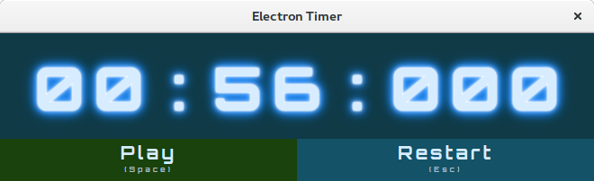
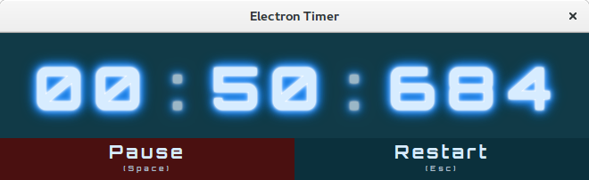

<div style="text-align:center">

</div>

# :alarm_clock: BTimer

This is a timer made with Web Technologies to work with all plataforms: web, mobile and desktop with node electron.

The Electron layer is used only to make it available as a Desktop application.  
You can use it as your Pomodoro Timer. :tomato:  
Ideal to be used in Dojos and Pair Programming. :shipit:   
You also can learn about the tecnologies exploring the source code. :books:

## Running

```sh
yarn install
yarn build-web
yarn start
```

## Developing

```sh
yarn install
yarn dev
```

## Contributing

Report Issues and submit Pull Requests. Feel free to contribute with ideas to improve this application. I'm planning to support themes soon, different colors, fonts and sounds, so contributing with new themes will be welcome.

## Screenshot





